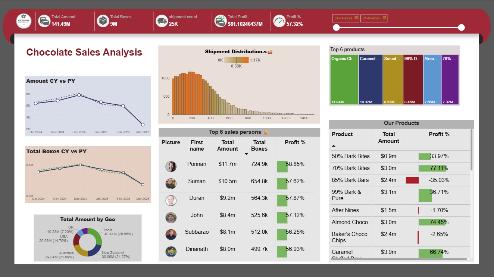

🛒🍫**Chocolate Sales Analysis — Power BI Dashboard**
📊**Project Overview**
The Chocolate Sales Analysis Dashboard provides a comprehensive overview of chocolate shipments, sales performance, and profitability across different regions, products, and salespersons.
The objective of this project is to identify sales patterns, evaluate top-performing products and regions, and assess profitability trends to support data-driven business decisions.

🧾**Dataset**
The dataset contains five related tables:
Shipments – Shipment-level transactions and quantities
Products – Product details including name, type, and pack information
People – Salesperson information
Locations – Regional and country details
Calendar – Date dimension table for time-based analysis

⚙️ **Data Modeling and Process**
Data Loading: Imported all five tables into Power BI from Excel.
Data Cleaning: Used Power Query to remove duplicates, fix data types, and handle missing values.
Modeling: Built a star schema model with Shipments as the fact table and Products, People, Locations, and Calendar as dimension tables.
DAX Calculations: Created measures for Total Amount, Total Boxes, Total Profit, Profit %, and Year-over-Year (YoY) metrics.
Optimization: Ensured proper relationships, reduced unnecessary columns, and improved refresh performance.

📈**Dashboard Details**
The dashboard consists of well-structured visuals and interactive filters that allow users to analyze performance across different perspectives.

**Key Visuals:**
CY vs PY Trends: Line charts comparing current and previous year performance for sales amount and total boxes.
Regional Performance: Donut chart showing total amount by geography.
Shipment Distribution: Histogram showing shipment frequency distribution.
Top Salespersons: Table showing the top six performers with total amount, boxes, and profit percentage.
Product Insights: Visuals displaying top products and profitability across different chocolate categories.
Interactive Filters: Date range and slicers for flexible analysis.

**Key Insights**
Sales show seasonal variation with a decline observed toward the end of the first quarter of 2025.
India leads with the highest total sales, followed by New Zealand and Australia.
Organic and Caramel chocolates are among the top-selling products.
Certain dark chocolate variants show negative profit margins, indicating a need for cost optimization.
Top salespersons (such as Ponnan and Suman) maintain high sales and consistent profitability.

🛠️ **Tools Used**
Power BI Desktop
Microsoft Excel (for dataset)
DAX (for calculations and KPIs)

🖼️ **Dashboard Preview**

**Conclusion**
This project demonstrates how Power BI can be used to transform raw sales data into meaningful insights. It highlights the ability to perform data modeling, create interactive dashboards, and communicate business insights effectively through visual storytelling.
